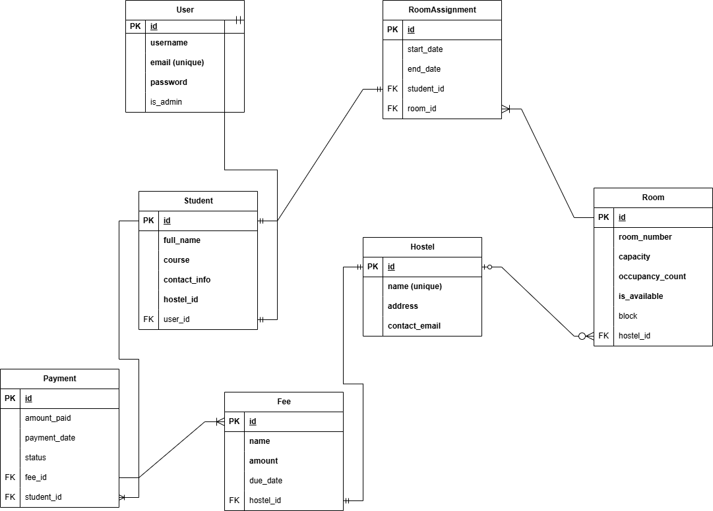

# 🏨 HostelMate - Multi-Hostel Management System

   

**HostelMate** is a robust API designed to manage operations for multiple student hostels. It automates room booking, handles rent & fee payments via Paystack, and enforces strict role-based access control for Hostel Managers and Students.

## 🚀 Key Features

* **Multi-Tenancy:** Single system supports multiple hostels (Unity Hall, Liberty Hall, etc.).
* **Automated Room Assignment:** Rooms are automatically assigned upon successful rent verification.
* **Smart Payments:** Integrated with **Paystack** to verify transactions securely.
* **Role-Based Access Control (RBAC):**
    * **Super Admin:** Controls all hostels.
    * **Hostel Manager:** Restricted to managing *only* their assigned hostel.
    * **Student:** Can only view their profile and make payments.
* **Race Condition Handling:** Uses database transactions (`atomic`) to prevent double-booking of rooms.

## 🛠️ Tech Stack

* **Backend:** Python, Django, Django REST Framework (DRF)
* **Authentication:** JWT (JSON Web Tokens) via Djoser
* **Database:** MySQL (Dev) / MySQL (Prod)
* **Payment Gateway:** Paystack API
* **Tools:** Postman (Testing), Git

## 📸 System Architecture

### Database Schema (ERD)

*(Note: Upload your ERD image to a 'docs' folder and link it here)*

### Payment Flow
1. **Student** requests payment link (`/initialize`).
2. **System** checks room availability (locks row).
3. **Paystack** processes transaction.
4. **Backend** verifies reference and assigns room (`/verify`).

## 💻 Installation & Setup

### Prerequisites
* Python 3.10+
* Git

### Steps

1. **Clone the repo**
   ```bash
   git clone [https://github.com/yourusername/hostelmate.git](https://github.com/yourusername/hostelmate.git)
   cd hostelmate

2. ### Create Virtual Environment

**Windows**
    ```bash
    python -m venv venv
    venv\Scripts\activate

**Mac/Linux**
    ```bash
    python3 -m venv venv
    source venv/bin/activate

3. ### Install Dependencies
    pip install -r requirements.txt

4. ### Django Settings
   SECRET_KEY=your_django_secret_key_here
   DEBUG=True

    Database (Optional: Defaults to SQLite if omitted)
    DB_NAME=hostel_db
    DB_USER=postgres
    DB_PASSWORD=password
    DB_HOST=localhost

   # Paystack Configuration
   PAYSTACK_SECRET_KEY=sk_test_your_paystack_secret_key
   PAYSTACK_PUBLIC_KEY=pk_test_your_paystack_public_key